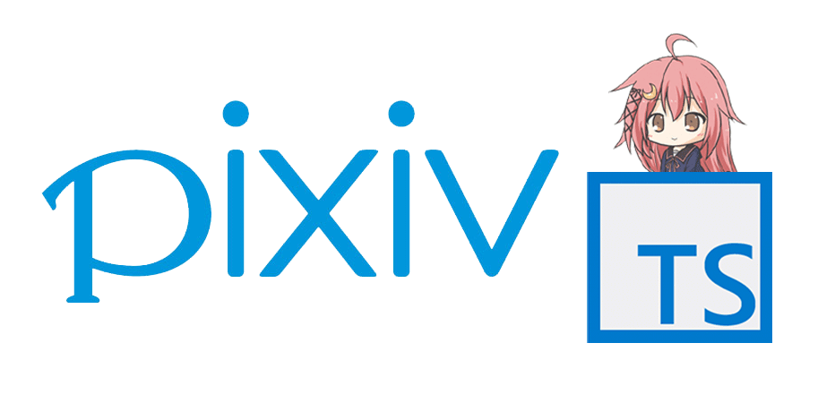

[](https://nodei.co/npm/pixiv.ts/)

### About
This is a wrapper for the Pixiv API that covers the mobile and desktop endpoints, includes typings, and offers various utility
functions to make downloading pixiv illusts easier.

### Insall
```ts
npm install pixiv.ts
```

This is a wip package, come back soon. 